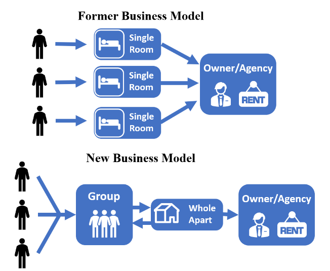
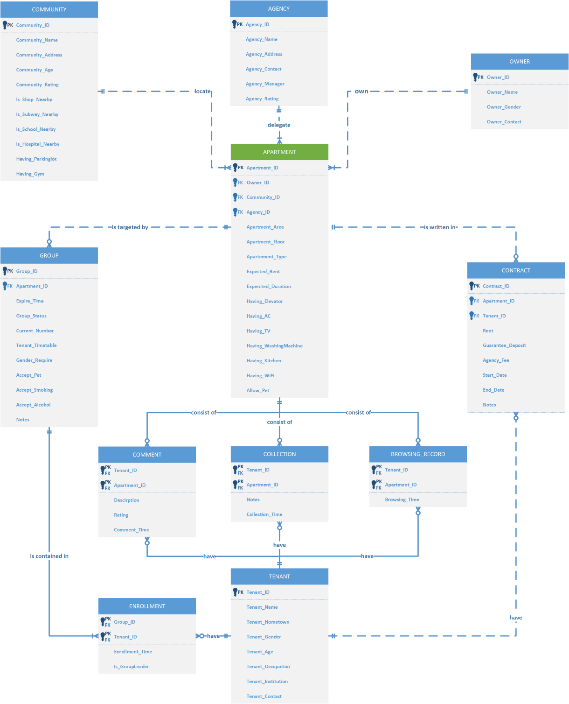

# WeRent - Find Your Soul Roomate

Please see the details of report in [Report.md](https://github.com/rogerchenfz/WeRent/blob/master/Report.md) and the code in [code.sql](https://github.com/rogerchenfz/WeRent/blob/master/code.sql) file.

## Background

We set up a company called WeRent that operates an online platform for housing  rental. On the basis of the traditional housing rental platform, our platform not only  collects all kinds of information about apartments but also provides users’ portrait and  intelligent recommendation to help tenants find the companions they would like to live  with – they can create a “Group” based on the apartment and label the group with  specific habits and preferences of expected roommates, or they can discover a group  with preferable labels created by others. Just as our slogan says, “Find Your Soul Roommate.”

### Business Model

In order to solve the problem presented above, we design a new business model about renting. 

## ER Model

The ER diagram drawn by Microsoft Visio is shown below There are 11 entities in the ER Diagram. The APARTMENT table is the main entities (with green  header), which contains the features and data about the apartments to be rent, such as the area, types, expected durations and so on. The customers’ information is designed to be stored in OWNER, TENANT and AGENCY respectively. The interactions between APARTMENT and TENANT are depicted by COMMENT, COLLECTION,  BROWSING_RECORD and CONTRACT.

## Relational Schema

- APARTMENT (**<u>Apartment_ID</u>**, Owner_ID, Community_ID, Agency_ID, Apartment_Area,  Apartment_Floor, Apartment_Type, Expected_Rent, Expected_Duration, Having_Elevator,  Having_AC, Having_TV, Having_WashingMachine, Having_Kitchen, Having_WiFi, Allow_Pet)
- AGENCY (**<u>Agency_ID</u>**, Agency_Name, Agency_Address, Agency_Contact, Agency_Manager,  Agency_Rating)
- OWNER (**<u>Owner_ID</u>**, Owner_Name, Owner_Gender, Owner_Contact)
- COMMUNITY (**<u>Community_ID</u>**, Community_Name, Community_Address, Community_Age,  Community_Rating, Is_Shop_Nearby, Is_Subway_Nearby, Is_School_Nearby, Is_Hospital_Nearby,  Having_Parkinglot, Having_Gym)
- CONTRACT (**<u>Contract_ID</u>**, Apartment_ID, Tenant_ID, Rent, Guarantee_Deposit, Agency_Fee,  Start_Date, End_Date, Notes)
- GROUP (**<u>Group_ID</u>**, Apartment_ID, Expire_Time, Group_Status, Current_Number,  Tenant_Timetable, Gender_Require, Accept_Pet, Accept_Smoking, Accept_Alcohol, Notes)
- TENANT (**<u>Tenant_ID</u>**, Tenant_Name, Tenant_Hometown, Tenant_Gender, Tenant_Age,  Tenant_Occupation, Tenant_Institution, Tenant_Contact)
- ENROLLMENT (**<u>Group_ID</u>**, **<u>Tenant_ID</u>**, Enrollment_Time, Is_GroupLeader)
- COMMENT (**<u>Tenant_ID</u>**, **<u>Apartment_ID</u>**, Description, Rating, Comment_Time)
- COLLECTION (**<u>Tenant_ID</u>**, **<u>Apartment_ID</u>**, Notes, Collection_Time)
- BROWSING_RECORD (**<u>Tenant_ID</u>**, **<u>Apartment_ID</u>**, Browsing_Time)

## User Instructions

- Entry Page
- Front Page
- Results Page
- Apartment Details Page
- Apartment-Group Page
- Group Details Page (Before Join)
- Create Groups Page
- Chatting Page
- Account Page (Not Log in)
- Login Page
- Personal Information Page
- Login Page (Logged in)
- Collections Page
- History Page
- My Groups Page
- Group Details Page (After Join)
- My Contract Page
- Contract Page
- My Release Page
- WeRent Customer Service Page
