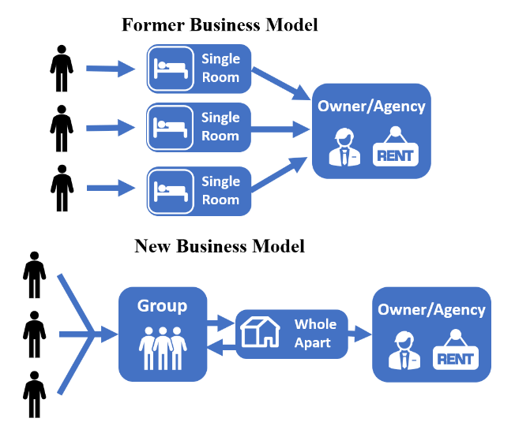
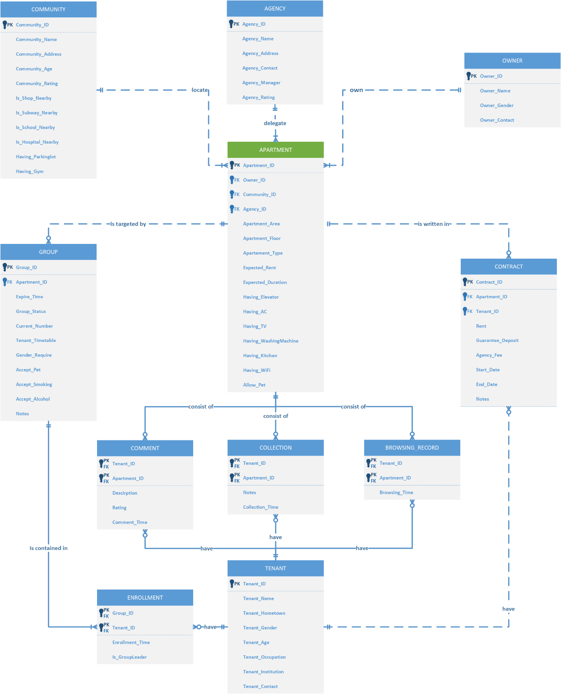

# Contents

## Summary

We set up a company called *WeRent* that operates an online platform for housing rental. On the basis of the traditional housing rental platform, our platform not only collects all kinds of information about apartments but also provides users’ portrait and intelligent recommendation to help tenants find the companions they would like to live with – they can create a “Group” based on the apartment and label the group with specific habits and preferences of expected roommates, or they can discover a group with preferable labels created by others. Just as our slogan says, “Find Your Soul Roommate.” 

This report mainly contains four parts: background, ER model, relational schemas and user instructions of our platform including how the main functions are implemented in MySQL. Based on the business rule, we built an ER model containing 11 entities such as apartment, tenant, agency and their relationships. Then we built the relational schemas for every entity. According to the ER model and relational schemas, we created our database which specifies these entities and the relationships among them. In order to better propagate our platform, we also drew the prototype of the platform in the applet. For each page, we provided thoughtful user instructions which can help our users more favorably use our platform. For readers better understanding how our functions are realized, we provided the MySQL code and parts of the running results in the report as well.

The main functions in our platform at this stage include discovering fine apartments and groups, joining or quitting groups, chatting with the landlord of interested apartment or the members in the interested group, and signing e-contracts directly between the group and the landlord.

## Background

### Existing Problems

Nowadays, the demand of co-renting keeps increasing due to the extremely high housing price. Particularly, many youngsters have to rent a room in order to reduce  living costs when they have an internship or have a job in big cities.

However, this induces a common problem that people might always have to live with someone who do not share the similar living patterns with them. For instance, they have to get up early for a morning shift while their roommates are having an overnight party. Under the current housing rental system which only focuses on showing the apartment information, this problem cannot be avoided because the roommate's  information is invisible before moving in the apartment. Now, when people try to find co-renting roommates, they usually go to post information on some social media platforms like Weibo or Douban. Such an approach, however, will be annoying in most of time: first, it takes a quite long time to find someone who is looking for renting an apartment in the same regions; second, there would be a certain fraud risk since anyone can be access to their information including the irregular agencies; third, due to the fact that these platforms are not specific for posting such information, the renting posts are mixed with the other news and might probably be ignored by potential roommates.

Therefore, it is time to fill a gap in such area: a new housing rental system is needed  to combine the roommates choosing and apartment choosing such that tenants can have better living experience and the stableness of renting relationship can also be improved.

### Business Model

In order to solve the problem presented above, we design a new business model about renting. 

In existing co-renting systems, each room in an apartment is separated and is an object in a contract. Tenants are supposed to sign the contract with the owner or agency individually. Yet in our business model, tenants are capable to find their preferred roommates first and then sign a contract where the object is the whole apartment.

In the new business model, we combine the process of selecting roommates and  choosing apartments. When tenants find a fancy apartment on the platform, they can  create a “Group” based on the apartment and label the group with specific habits and  preferences of expected roommates, or they can discover a group with preferable labels  created by others. When the number of group members reaches the number of rooms in  the aimed apartment, group members can have discussions with the owner of the  apartment about details of contract.

Once group members and the owner reach a consensus, the status of the apartment and the group would be altered. All group members would be kicked out of other unsigned groups they joined as well.

### SWOT Analysis

**Strengths**

- Now the main housing rental companies in China do not have similar business model.
- Tenants can find the roommates that have similar habits and lifestyles with them.

**Weaknesses**

- We are a startup company with a small scale so that we need financing to grow.
- Rental platform has the characteristic of financing: potential customers might have trust issue.

**Opportunities**

- The business model is novel and profitable so that it can attract investors to invest.
- We open up a new blue ocean market where tenants can rent a house with happier life.

**Threats**

- As a latecomer in the house renting market, our company might have less brand awareness and  influence than the giants like Lianjia and Airbnb.
- The business model is easy to be replicated by other competitors.

## ER Model

The ER diagram drawn by Microsoft Visio is shown below There are 11 entities in the ER Diagram. The APARTMENT table is the main entities (with green  header), which contains the features and data about the apartments to be rent, such as the area, types, expected durations and so on. The customers’ information is designed to be stored in OWNER, TENANT and AGENCY respectively. The interactions between APARTMENT and TENANT are depicted by COMMENT, COLLECTION,  BROWSING_RECORD and CONTRACT.

## Relational Schema

- APARTMENT (**<u>Apartment_ID</u>**, Owner_ID, Community_ID, Agency_ID, Apartment_Area,  Apartment_Floor, Apartment_Type, Expected_Rent, Expected_Duration, Having_Elevator,  Having_AC, Having_TV, Having_WashingMachine, Having_Kitchen, Having_WiFi, Allow_Pet)
- AGENCY (**<u>Agency_ID</u>**, Agency_Name, Agency_Address, Agency_Contact, Agency_Manager,  Agency_Rating)
- OWNER (**<u>Owner_ID</u>**, Owner_Name, Owner_Gender, Owner_Contact)
- COMMUNITY (**<u>Community_ID</u>**, Community_Name, Community_Address, Community_Age,  Community_Rating, Is_Shop_Nearby, Is_Subway_Nearby, Is_School_Nearby, Is_Hospital_Nearby,  Having_Parkinglot, Having_Gym)
- CONTRACT (**<u>Contract_ID</u>**, Apartment_ID, Tenant_ID, Rent, Guarantee_Deposit, Agency_Fee,  Start_Date, End_Date, Notes)
- GROUP (**<u>Group_ID</u>**, Apartment_ID, Expire_Time, Group_Status, Current_Number,  Tenant_Timetable, Gender_Require, Accept_Pet, Accept_Smoking, Accept_Alcohol, Notes)
- TENANT (**<u>Tenant_ID</u>**, Tenant_Name, Tenant_Hometown, Tenant_Gender, Tenant_Age,  Tenant_Occupation, Tenant_Institution, Tenant_Contact)
- ENROLLMENT (**<u>Group_ID</u>**, **<u>Tenant_ID</u>**, Enrollment_Time, Is_GroupLeader)
- COMMENT (**<u>Tenant_ID</u>**, **<u>Apartment_ID</u>**, Description, Rating, Comment_Time)
- COLLECTION (**<u>Tenant_ID</u>**, **<u>Apartment_ID</u>**, Notes, Collection_Time)
- BROWSING_RECORD (**<u>Tenant_ID</u>**, **<u>Apartment_ID</u>**, Browsing_Time)

## Functional Dependencies and Normalization

The functional dependency diagram is shown below. By our design, the partial dependency and transitive dependency are eliminated and primary keys can be uniquely identified, thus all relations are in the third normal form.

## User Instructions

### Entry Page

This is the entry page of our platform, WeRent, on the applet. In the middle the logo of our platform is showed and under it there is a simple greeting for our users. 

### Front Page

At the top, the front page shows the commonly used categories of apartment listings, like entire renting, co-rent, BigName (the apartments surrogated by premium agencies) and recommended.

Then two popular types of apartments are showed, followed by the high-quality apartments nearby, which is convenient for users to filter out the fine housing resources.

In this page, users can search the preferred district and discover the available apartments in it.

### Results Page

According to the search content input by users, the search results would be showed in a list of apartments.  Users can choose to filter out them in further steps or order the results by different standards.

### Apartment Details Page

After users click on the apartment listings from the front page or the search results page, they would come into the apartment details page, in which all details about the apartment would be showed, including comments, nearby housing and the information of the landlord.

Besides browsing the page, users can also do some operations, like collecting, writing comments and viewing all available groups toward this apartment. 

### Apartment-Group Page

After clicking the “View Groups” button on the above page, users would see all available groups that they can join in a list.

### Group Details Page (Before Join)

User can click one specific group in the above page and see the group details page, in which the expected living patterns of future roommates would be displayed. If users think they share the similar lifestyles with the group member, they can join the group.

Users can also review the apartment details again from this page.

### Create Groups Page

In this page, there are some boxes to be filled or chosen. 

When taping the photo box at the top of this page, group creator can change the profile of the group. The other boxes in the list are connecting with the attributes in the database table Group. 

After all the necessary boxes are filled, group creator can type the “Post” button to post the group information onto the Groups Page.

### Chatting Page

When click on the “Text” icon in the bottom navigator, users can enter the Recent Talks Page. The recent messages boxes will be presented here ordered by the time.

### Message Page

When taped on: (1) boxes in the Chatting Page (2) profiles of the other users (3) Chat with Landlord button in the Apartment Detail Page, the Messages Page will be popped up and the user can chat with the others.

To return the former Chatting Page, users can just click on the return icon on the top left.

### Account Page (Not Log in)

This is the account page when users have not logged in or signed up. Users cannot do further operations without logging in. 

### Login Page

When taping on the profile box, the Login Page pops out. Users can enter their phone number and log in (or register) with message code.

### Personal Information Page

If a user does not have an account before, then the Personal Information Page will be presented automatically at first. Also, for the registered users, if they want to change the personal information, this page can be entered by tapping on the profile box in logged in Account Page manually.

Users are required to filled some essential information boxes in this page, which are related to insert a record in the database Tenant Table.

### Login Page (Logged in)

After logging in, the Account Page will be changed. Users’ id and motto will be shown. Besides, the other functions like Collection, History and so on are now available.

### Collections Page

The collections page shows the apartments users collected. In this page, each row represents an apartment with information about renting types (e.g., Entire), number of bedrooms and bathrooms (e.g., 1B1B), renting deposit (e.g., \$950/m), area of the apartment (e.g., 30$m^2$), towards direction (e.g., South). If you want to cancel the collection, just press the red heart, and when it turn grey, you will successfully cancel the collection. 

### History Page

The history page demonstrates all the apartments that users have ever browsed. In this page, each row represents an apartment with information regarding to renting types (e.g., Entire), number of bedrooms and bathrooms (e.g., 1B1B), renting deposit (e.g., \$950/m), area of the apartment (e.g., 30$m^2$), towards direction (e.g., South). What’s more, three tags will be showed whether the apartment is recommended by your browsing preference (e.g., REC in green bar), whether the apartment is well equipped with all kinds of furniture (e.g., Equipped), and the payment method (e.g., Bet1Pay3 stands for deposit is one month rent, and each payment is for 3 months’ rent.)

### My Groups Page

My groups page reveals all the groups that users have ever joined. Here, you can filter the groups by the status, by the number of people in the group or by the gender the group required. Also, users can order the groups. Each row is a group, with group name, status, current gender distribution, a greeting sentence, gender required. Users can click the group to enter the group details page.

### Group Details Page (After Join)

Group details page show the detailed information related to the group. In this page, the group profile, group name, the expire time, gender requirement, timetable, pet acceptance, smoking acceptance, alcohol acceptance, and other notes left by the group leader. And users can scroll down this page to see all the group members. In the bottom bar, there are 3 buttons. Details button will show more information about the apartment. If you click Quit button, you can quit this group quickly. And SIGN NOW is only available for the group leader which will lead the leader to sign the contract! Once the group leader click this button, other group members would receive a notice and they can choose whether to agree signing the contract.

### My Contract Page

My contract page shows the brief information about the contract signed. The contract ID, apartment ID, rent, start date, end date, agency fee, guarantee deposit and notes are shown in this page. If users are interested in the details regarding to the contract, they are able to press “Preview” button to preview more information about this contract.

### Contract Page 

Contract page is the result of pressing “Preview” button in My Contract page. Here, users will see a formal contract, including all agreements and clauses the group has made with the landlord regarding to renting this apartment. If press “Download/Share” button, users can download a sharable e-contract to the phone which they can send to anyone.

### My Release Page

My release page will show all the properties users are currently releasing to the market. Unfortunately, this page will only show the release that users have already made, and it is not capable to start a new release constraint to our Mini-Program. If users are intended to start a new one, users are welcomed to utilize this function via our application.

### WeRent Customer Service Page

WeRent provide a full range of customer services. If users encounter a problem with the function during using our Mini-Program, they are free to contact us through our online customer service, and WeRent will answer questions as soon as possible. If there are any comments or suggestions regarding to our functions, users are highly encouraged to leave a message to us in this page as well. As shown in the sample on the right side, the user is confused by how to start a new group, so he/she left a message consulting this problem. And our online Customer Service quickly answered the question. 

## Conclusions

Aiming at providing a brand-new way for house co-renting for youngsters, we set up a company called *WeRent* and developed the corresponding app *WeRent*. Taking advantage of the *WeRent*, tenants can create or join in groups where group members share similar life styles and habits. Once all group members reach an agreement, they can sign a contract with the house owner as a group. In this way, tenants are more likely to find satisfactory roommates compared to traditional house renting platform, just as our slogan says, “Find Your Soul Roommate”.

In the design phase, an ER model containing 11 entities is created to identify the overall structure of our system. Consequently, functional dependencies between entities are carefully checked to make sure all relations are in 3NF. The corresponding data dictionary and relational schema for every table are also given.

In the implementation stage, SQL scripts are created on MySQL to create the database and corresponding tables in the ER model and to realize the functions of *WeRent* app. Furthermore, prototypes our app are also given to illustrate specific functions and detailed user instructions are provided in the implementation report.

Due to the time limit, the front-end interfaces of *WeRent* were not realized and more functions need to be implemented to make the app mature enough to compete with other existing competitors. For example, apart from co-renting, functions related to single-renting will also be implemented in the future.
